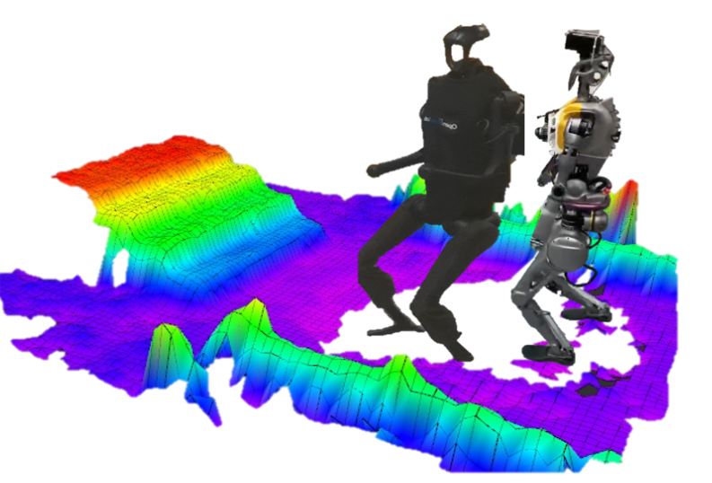

# elevation_mapping_humanoid

This repository implements an elevation map on multiple humanoid robots with a single MID-360 LiDAR. **Note that the contribution of this repository is mainly on engineering and most of the credits should be attributed to the original research paper listed below. If you find this repository useful, please consider citing them:**

[1] Fankhauser P, Bloesch M, Hutter M. Probabilistic terrain mapping for mobile robots with uncertain localization[J]. IEEE Robotics and Automation Letters, 2018, 3(4): 3019-3026.

[2] Xu W, Zhang F. Fast-lio: A fast, robust lidar-inertial odometry package by tightly-coupled iterated kalman filter[J]. IEEE Robotics and Automation Letters, 2021, 6(2): 3317-3324.
